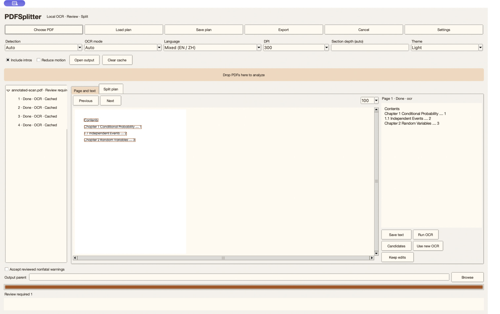

# PDFSplitter

**Recognize scanned documents locally, review chapter boundaries, and split the original PDF.**

[](https://github.com/JeremyL691/PDFSplitter/actions/workflows/tests.yml)
[](LICENSE)
[](requirements.txt)
[](docs/VALIDATION.md)

[Quick start](#quick-start) · [User guide](docs/USAGE.md) · [Validation](docs/VALIDATION.md) · [Roadmap](docs/STATUS.md) · [Contributing](CONTRIBUTING.md)

Organize textbooks, lecture notes, and scanned books by chapter. PDFSplitter uses Apple PDFKit and Vision to extract page text, compares bookmarks, contents pages, and body headings, and produces a split plan you can review. OCR runs locally without cloud services.

> **v0.3.0 development preview:** Core features are implemented and all 33 local tests pass. macOS 13+ is the build target; the tested environment is Apple Silicon / macOS 27.0 / Python 3.12. Older systems, Intel hardware, physical Finder drag-and-drop, and release acceptance remain pending. See [project status](docs/STATUS.md).

<picture>
  <source media="(prefers-color-scheme: dark)" srcset="docs/evidence/ui-after-dark.jpg">
  
</picture>

*Actual application screenshot showing a scanned contents page, text boxes, recognized text, and per-page status. [View the before-and-after comparison](docs/VALIDATION.md#interface-comparison-and-desktop-interaction).*

## From recognition to export

**Import PDF → Analyze and OCR → Preview and correct → Rebuild plan → Export**

| Feature | What it provides |
| --- | --- |
| Local OCR | English, Simplified Chinese, Traditional Chinese, and mixed text; automatic, disabled, or forced recognition; two recognition passes with preserved alternatives |
| Chapter analysis | Structure from bookmarks, contents pages, and body headings; Parts, repeated chapter numbers, Chinese numbering, and sections sharing a page |
| Review and correction | Page navigation, zoom, text boxes, editable text, titles, chapter assignment, and ranges; add, merge, divide, or exclude entries |
| Reusable plans | Save and load JSON, preserve manual edits during OCR reruns, and cache completed pages |
| Safe export | Validate ranges and source hashes, publish completed staging directories, and preserve original page content |
| GUI and CLI | Desktop batch processing, page progress, themes, and command-line analysis and plan application |

Model confidence is a review signal, not an accuracy percentage. Exported PDFs preserve the original pages; searchable PDF text layers are not included yet.

## Quick start

Requires **macOS, Python 3.12 with Tk, and Xcode Command Line Tools**. Run from source; an application installer is not available yet.

```bash
git clone https://github.com/JeremyL691/PDFSplitter.git
cd PDFSplitter
python3.12 -m venv .venv
source .venv/bin/activate
python -m pip install -r requirements.txt
python native/build.py
python main.py --ocr-status
python main.py --gui
```

Select a PDF to analyze it. Inspect recognition in `Page and text`, adjust ranges in `Split plan`, review warnings, then select `Export`. Importing does not immediately write split PDFs.

The CLI can also save a plan before export:

```bash
python main.py book.pdf --dry-run --plan-out review.json
python main.py --apply-plan review.json -o output --accept-warnings
```

`--accept-warnings` acknowledges reviewed nonfatal warnings. It cannot bypass invalid or overlapping ranges or a changed input. Exit code `3` means review is required. [Complete CLI and desktop guide](docs/USAGE.md)

## Exported files

Each export includes chapter PDFs and records for review and reuse:

```text
output/
  <chapter>/
    <section>.pdf
  document.txt       # Final text separated by page
  ocr.json           # Positions, sources, confidence, and alternatives
  split-plan.json    # Structure, ranges, manual edits, and input hash
  manifest.json
  manifest.txt
```

Default exports allocate a new directory if the target exists. An explicit `-o` never overwrites a nonempty directory. Changed source content invalidates an old plan. [Export and cache rules](docs/USAGE.md#analysis-cache-and-export-rules)

## Validation and next steps

The suite contains 15 structure/export tests, 9 recovery tests, 5 real Vision tests, and 4 Tk tests. The repository includes an [annotated scan](docs/evidence/annotated-scan.pdf), [acceptance results](docs/evidence/native-acceptance.json), and [raw test log](docs/evidence/test-run.txt). CI status is reported by the Actions badge and run records; local results do not replace remote validation.

Complex columns, blurred or skewed scans, handwriting, formulas, and unusual layouts still require review. Next steps prioritize desktop and platform acceptance and broader real-document coverage. Searchable PDF layers, an installer, and OCR on other platforms are future work.

- [Project status and priorities](docs/STATUS.md)
- [Development handoff and review checklist](docs/HANDOFF.md)
- [Contributing and testing](CONTRIBUTING.md)
- [Changelog](CHANGELOG.md)

## License

[MIT](LICENSE) · Copyright © 2026 JeremyL691
