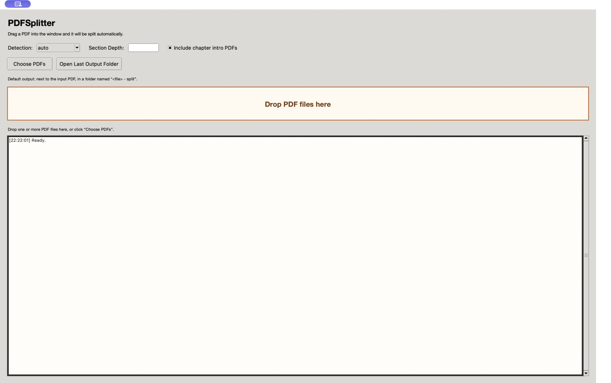
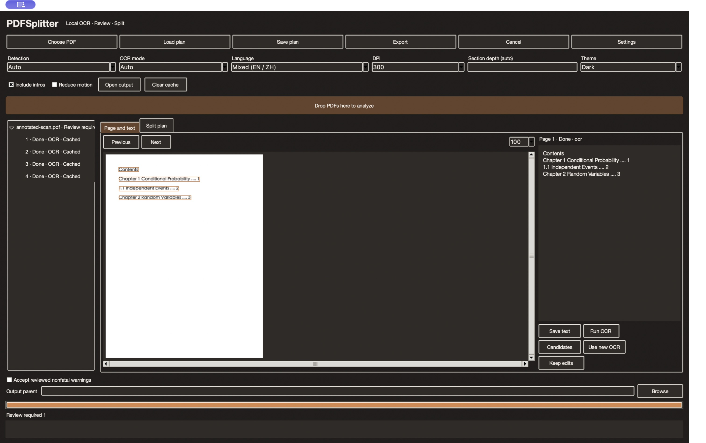

# v0.3.0 validation record

This iteration delivers chapter-detection fixes, shared analysis/validation/export interfaces, a native OCR helper, preview correction, CLI support, regressions, and CI configuration. Results below distinguish actual execution from pending acceptance.

## Local environment and results

Tested on Apple Silicon arm64, macOS 27.0 (26A428), Python 3.12.0, and Swift 6.4. The helper targets macOS 13; a deployment target does not establish acceptance on older systems.

The full native and desktop suite was rerun before publication: **33 tests passed with no skips**. See [test-run.txt](evidence/test-run.txt).

```bash
PDFSPLITTER_NATIVE_TESTS=1 PDFSPLITTER_GUI_TESTS=1 \
PDFSPLITTER_CACHE_DIR=/private/tmp/pdfsplitter-v030-cache \
PYTHONDONTWRITEBYTECODE=1 python3.12 -m unittest discover -v
python3.12 -m tests.acceptance
```

| Category | Evidence and scope |
| --- | --- |
| Structure/export, 15 tests | Generated PDFs with repeated numbers, Parts, section-only and nested bookmarks, partial bookmarks, early body references, ordered contents mapping, Chinese/Appendix numbering, same-page bilingual headings and sections, invalid depths, paths and hashes, original content-stream equality, manifest/file counts |
| Recovery, 9 tests | Injected timeouts, page errors, and cancellation verify process closure/restart and subsequent-page continuation; cache reuse/invalidation, manual/pending text persistence, source/hard-link conflicts, invalid bookmarks, CLI plans |
| Real Vision, 5 tests | English, Simplified/Traditional Chinese, mixed text on one line, English-pass Chinese omission regression; scanned and two-column contents, native/scanned mixed pages, rotation, CropBox, caching, forced recognition. Predefined text, numbers, boundaries, and positions are checked, not merely the presence of returned text |
| Desktop Tk, 4 tests | Actual windows and application flows; widths 320/768/1024/1440, light/dark/system themes, reduced motion; corrections/rebuild, merge/divide/exclude/restore, manual edits versus OCR reruns, batch failure isolation, actual export, and Tk callback exception capture |

Timeout and cancellation fault tests use controlled substitutes. They do not establish that all real Vision pressure failures have been tested. Normal OCR tests call local Vision without OCR mocks.

## Reproducible scan sample

[annotated-scan.pdf](evidence/annotated-scan.pdf) is a four-page image-only PDF generated for this iteration. [annotation.json](evidence/annotation.json) contains predefined text and ranges. Page 1 contains the contents; pages 2, 3, and 4 each produce a single-page PDF.

[native-acceptance.json](evidence/native-acceptance.json) and [verified-plan.json](evidence/verified-plan.json) record recognition. The plan uses an input path relative to the repository root with the original hash. Every page matches the annotation, ranges are `[[2,2],[3,3],[4,4]]`, three PDFs were exported, and the source hash is unchanged. Additional regressions compare original page content streams.

Page 2 is recognized correctly but receives low model confidence. The application emits `low_confidence` and requires review, demonstrating confidence as a diagnostic rather than an accuracy measure.

The historical textbook source was unavailable. Old split outputs were not counted as a rerun. Acceptance uses new accessible samples with annotations.

## Interface comparison and desktop interaction

The original screenshot comes from a temporary checkout of baseline `1d29020`. Updated screenshots show the running Tk application with a scanned contents preview, boxes, recognized text, cache state, and review status.

| Original | Updated light | Updated dark |
| --- | --- | --- |
|  |  |  |

The native file picker was opened by keyboard and used to select the acceptance PDF. Tests validate multiple-file drag data with spaces and the batch entry point. **Physical Finder-to-application dragging remains pending:** desktop automation could operate the native dialog and keyboard, but coordinate clicks did not reliably produce Tk control events. Successful tool calls were not counted as completed dragging.

Manual entry point: `python3.12 -m tests.gui_demo --theme light`. Drag multiple PDFs and inspect sequential analysis; correct text and rebuild; rerun OCR while preserving edits; check boundaries and acknowledge reviewed nonfatal warnings; export to a new directory. Closing the window should cancel work and wait for staging cleanup.

## CI, compatibility, and remaining acceptance

`.github/workflows/tests.yml` defines Linux core tests and macOS native OCR tests. The configuration is published, but **remote CI has not run; GitHub Actions is currently disabled for the repository**. GUI tests need a graphical session and are enabled locally.

macOS 13/14, Intel Macs, and other Python versions have not received hardware acceptance. Current Apple Silicon results do not establish those combinations. An installer and searchable PDF text layers remain future scope.

Clear synthetic samples pass. Skew, blur, handwriting, formulas, complex columns, unusual fonts, and frequent headers/footers still require manual review. Layout recovery and contents mapping use positional and ordering evidence and cannot guarantee every layout. Vision updates may change results; cache keys include system and processing versions.

The implementation and local automated acceptance are usable. Cross-platform, remote CI, and physical Finder dragging gates in M5 remain open.
